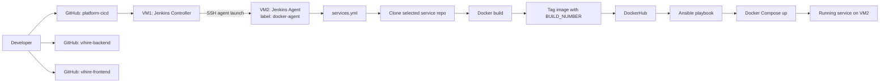

# Architecture

## Runtime Flow

1. Jenkins job loads `platform-cicd/Jenkinsfile`.
2. User provides `SERVICE` and `BRANCH`.
3. Jenkins reads `services.yml` and selects the matching service metadata.
4. Jenkins clones the selected service repository branch into `source/`.
5. Jenkins builds `${docker_image_name}:${BUILD_NUMBER}`.
6. Jenkins pushes the image to DockerHub.
7. Jenkins runs Ansible against the `vm2` inventory target.
8. Ansible copies the selected Compose template and writes `.env`.
9. Docker Compose pulls and starts the requested image on VM2.
